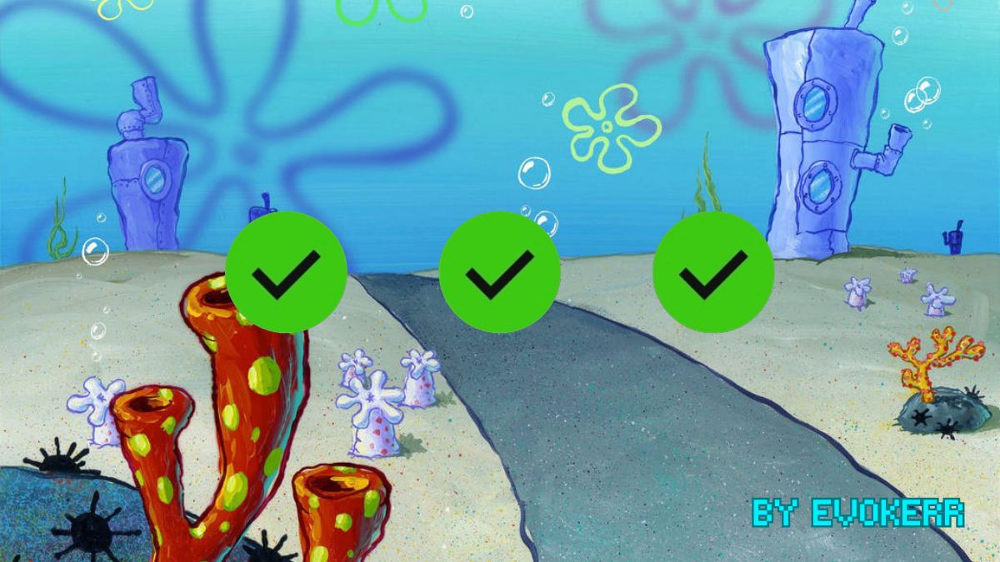
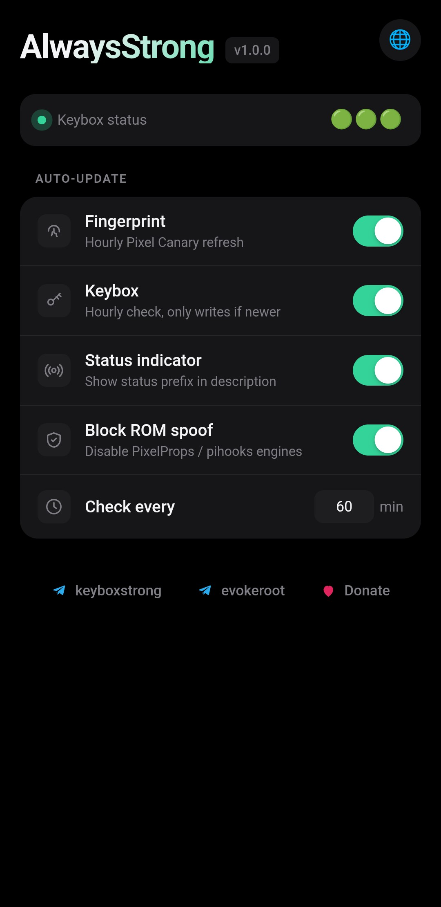
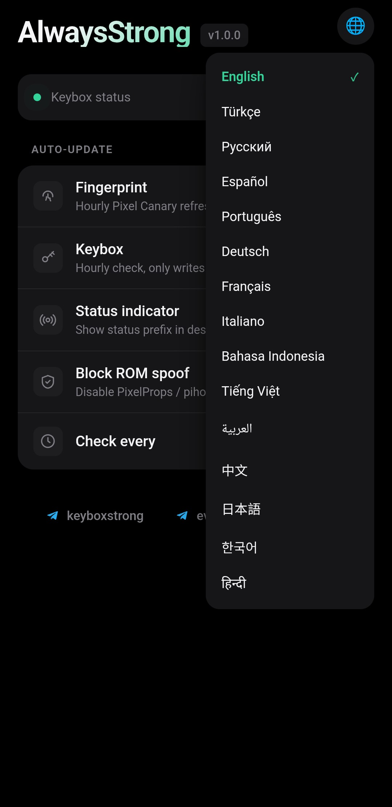

<div align="center">



[](https://github.com/evoker0/AlwaysStrong/releases/latest)
[](https://github.com/evoker0/AlwaysStrong/releases)
[](LICENSE)
[](https://t.me/keyboxstrong)

<br>

 &nbsp; 

<sub>Built-in WebUI on KernelSU / APatch — hourly auto-update toggles, translated into 15 languages.</sub>

</div>

# AlwaysStrong

One-flash `STRONG` Play Integrity for Magisk / KernelSU / APatch. It bundles [TEESimulator-RS](https://github.com/Enginex0/TEESimulator-RS) and [PlayIntegrityFork](https://github.com/osm0sis/PlayIntegrityFork) into a single module so you don't have to stack and wire them up yourself.

To use this module you need one of the following (latest versions), with a Zygisk implementation installed:

- [Magisk](https://github.com/topjohnwu/Magisk) with Zygisk enabled — a standalone [Zygisk Next](https://github.com/Dr-TSNG/ZygiskNext) / [ReZygisk](https://github.com/PerformanC/ReZygisk) / [NeoZygisk](https://github.com/JingMatrix/NeoZygisk) is recommended over Magisk's built-in Zygisk, which is more easily detected
- [KernelSU](https://github.com/tiann/KernelSU) or [KernelSU Next](https://github.com/KernelSU-Next/KernelSU-Next) with [Zygisk Next](https://github.com/Dr-TSNG/ZygiskNext) or [ReZygisk](https://github.com/PerformanC/ReZygisk) or [NeoZygisk](https://github.com/JingMatrix/NeoZygisk) module installed
- [APatch](https://github.com/bmax121/APatch) with [Zygisk Next](https://github.com/Dr-TSNG/ZygiskNext) or [ReZygisk](https://github.com/PerformanC/ReZygisk) or [NeoZygisk](https://github.com/JingMatrix/NeoZygisk) module installed

Android 10+ (SDK 29) is required.

## Join group / channel

- Channel — [t.me/keyboxstrong](https://t.me/keyboxstrong)
- Root community — [t.me/evokeroot](https://t.me/evokeroot)
- Chat / support group — [t.me/keyboxstrongchat](https://t.me/keyboxstrongchat)

## Support

If AlwaysStrong is useful to you, you can tip at [coindrop.to/evokerrr](https://coindrop.to/evokerrr).

## Features

- **One flash, `STRONG`.** TEESimulator-RS + PlayIntegrityFork in a single module. No stacking, no manual wiring.
- **Keybox on tap.** The first **Action** fetches a working keybox automatically. No hunting, no manual placement.
- **A fingerprint that never goes stale.** Every Action pulls a fresh Pixel fingerprint and matching security patch — and a background service does the same **automatically every hour** (interval configurable, each toggle-able from the WebUI), so your spoof keeps up with Google's rotations even if you never open the module.
- **Hands-off keybox too.** The same hourly service re-checks your keybox and only swaps it in when a newer one is available, restarting Play Integrity only when something actually changed.
- **Auto target.** A native watcher follows package changes via inotify, with a full rebuild on every Action tap and hourly — **install a new app and it's added to the attestation target instantly, with no need to reopen the module or tap Action again.**
- **Xposed-aware.** The same watcher drops Xposed / LSPosed managers from the target list, since attesting through a hooked process breaks `STRONG`.
- **Conflict resolution.** Detects known conflicting modules (TrickyStore, other PIF / TEE forks, SafetyNet Fix, MagiskHidePropsConf, and more) and disables and removes them at install and on every boot, so a leftover module can't silently fight AlwaysStrong.
- **GMS kill.** Force-stops DroidGuard (`com.google.android.gms.unstable`) and clears the Play Store on each refresh, so a new fingerprint or keybox takes effect without a reboot.
- **Security-patch sync.** Keeps the OS / vendor / boot security-patch levels reported in attestation aligned with the spoofed fingerprint.
- **One clean module.** PIF is binary-patched to run inside `tricky_store` — it never litters a separate `playintegrityfix` folder under `/data/adb/modules`.

## About module

AlwaysStrong is two parts glued into one module:

- **TEESimulator-RS** intercepts Binder IPC inside the `keystore2` process and builds full attestation certificate chains from your keybox, so apps that verify hardware key attestation see a legitimate TEE. It is not a fork of TrickyStore; it reuses the same `/data/adb/tricky_store` config layout for drop-in compatibility, but the internals (native Rust certgen, `lsplt` interception, key persistence) are different.
- **PlayIntegrityFork** injects a `classes.dex` to modify `android.os.Build` fields and hooks native code to spoof system properties, only to Google Play Services' DroidGuard (Play Integrity).

The two are merged so they coexist in one module: TEESimulator's `classes.dex` is renamed to `tee_classes.dex` so it doesn't collide with PIF's, and PIF's hardcoded module paths are binary-patched to point at `/data/adb/modules/tricky_store` — it never creates a separate `playintegrityfix` folder. The module id stays `tricky_store` so existing tooling and tutorials keep working unchanged.

## Installation

1. Install a Zygisk implementation (Zygisk Next / ReZygisk / NeoZygisk).
2. Download the latest ZIP from [Releases](https://github.com/evoker0/AlwaysStrong/releases/latest).
3. Flash it in your root manager and reboot.
4. Open the module and tap **Action**.
5. Check your verdict with a checker (Play Integrity API Checker, YASNAC, Simple PIC).

The first Action tap fetches a working keybox and a fresh Pixel fingerprint and restarts Play Integrity, so there is no manual keybox step. The installer also removes conflicting standalone modules at install time (TrickyStore, PlayIntegrityFix/Fork, TEESimulator, playcurl/playcurlNEXT, SafetyNet Fix, MagiskHidePropsConf, Tricky Addon, Yurikey, and a few others).


## Configuration

All config files live at `/data/adb/tricky_store/` and are reloaded automatically when changed. The Action button keeps them current, so most users never need to touch these.

### keybox.xml

The attestation keybox. Fetched automatically on the first Action tap. To use your own, place it here and it won't be overwritten. To point the auto-refresh at a different mirror, set `KEYBOX_URL` (any raw HTTPS URL that returns a valid keybox) at the top of `keybox_fetch.sh`; the script validates the payload before replacing the current file, so a bad download can't break attestation.

## The Action button

Triggered from your root manager, or by running `sh action.sh` in a root shell. Each tap:

- rebuilds `target.txt`
- refreshes the keybox
- pulls a fresh Pixel fingerprint and security patch (`autopif4`)
- restarts DroidGuard and the Play Store

The verdict updates a few seconds later. No reboot is needed unless you swapped the keybox. The same fingerprint, security-patch and keybox refresh also runs on its own in the background every hour (interval configurable from the WebUI), so the module keeps passing with zero manual upkeep.

## Building

The repo ships no upstream binaries. `build.sh` downloads the pinned upstream release ZIPs, overlays the glue scripts in `module/`, and produces one installable ZIP. On Windows run it from WSL or Git Bash.

```bash
./build.sh                              # pinned upstream versions
./build.sh --clean                      # wipe build/ and rebuild
./build.sh --tee v6.0.1-282 --pif v17   # override upstream tags
```

Output is `out/AlwaysStrong-<version>.zip`. Bump upstream pins by editing the defaults at the top of `build.sh`, or run `scripts/update-upstream.sh --apply` to pull the latest. A daily GitHub Action does this and opens a PR.

## Credits

- [JingMatrix](https://github.com/JingMatrix/TEESimulator) — original TEESimulator and keystore2 interception
- [Enginex0](https://github.com/Enginex0/TEESimulator-RS) — TEESimulator-RS (Rust port, native certgen, AOSP-spec attestation)
- [5ec1cff](https://github.com/5ec1cff/TrickyStore) — TrickyStore, which pioneered keystore interception and the config-dir layout reused here
- [chiteroman](https://github.com/chiteroman) — original Play Integrity Fix
- [osm0sis](https://github.com/osm0sis/PlayIntegrityFork) — PlayIntegrityFork, the maintained fork bundled here
- [Displax](https://github.com/Displax/safetynet-fix) — module boot scripts forked into PIF
- [daboynb](https://github.com/daboynb/playcurlNEXT) — fingerprint auto-refresh approach
- [LSPlt](https://github.com/LSPosed/LSPlt) (PLT hooks) and [ring](https://github.com/briansmith/ring) (Rust crypto)

Packaging by [@evokerr](https://t.me/evokerr).


## License

GPL-3.0. AlwaysStrong bundles TEESimulator-RS (GPL-3.0), which makes the combined distribution GPL-3.0. See [LICENSE](LICENSE) and the upstream repos for full terms. Provided as-is, with no warranty; `STRONG` depends on a non-revoked hardware keybox, which the module cannot mint for you.
