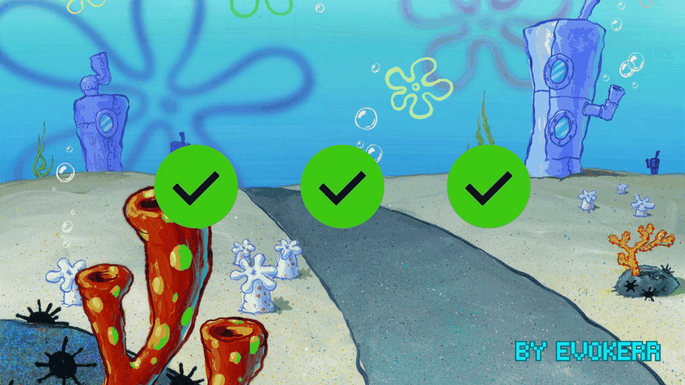
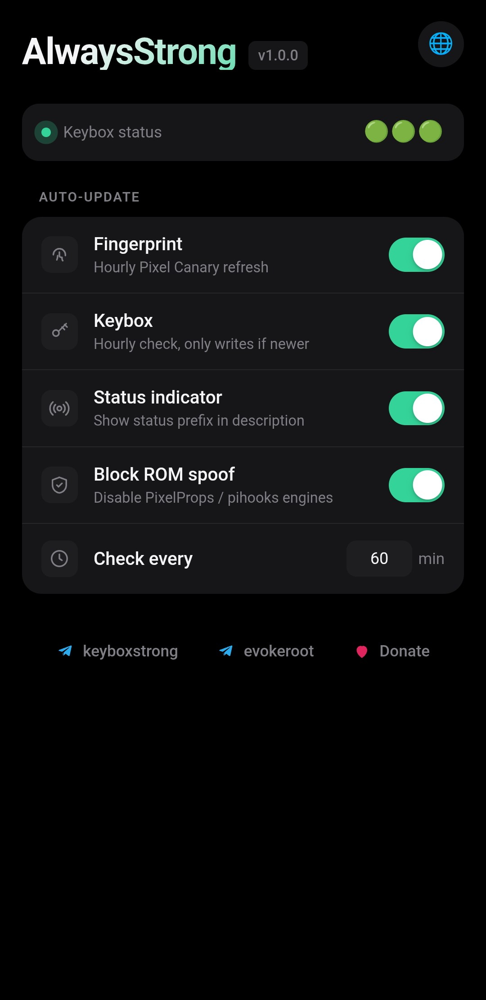
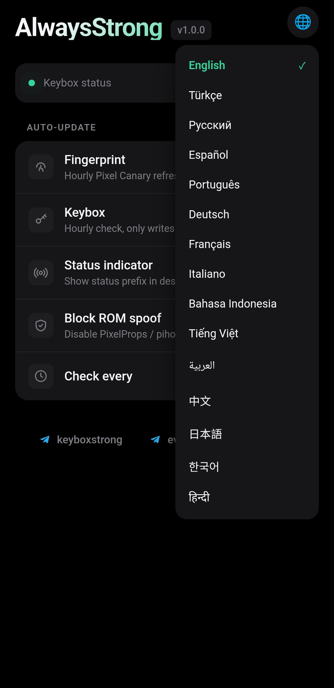

<div align="center">



<br>
<br>

[](https://github.com/evoker0/AlwaysStrong/releases/latest)
[](https://github.com/evoker0/AlwaysStrong/releases)
[](LICENSE)
[](https://t.me/keyboxstrong)

 &nbsp; 

<sub>Built-in WebUI on KernelSU / APatch — hourly auto-update toggles, translated into 15 languages.</sub>

</div>

# AlwaysStrong

One-flash `STRONG` Play Integrity for Magisk / KernelSU / APatch. It bundles [TEESimulator-RS](https://github.com/Enginex0/TEESimulator-RS) and [PlayIntegrityFork](https://github.com/osm0sis/PlayIntegrityFork) into a single module so you don't have to stack and wire them up yourself.

To use this module you need one of the following (latest versions), with a Zygisk implementation installed:

- [Magisk](https://github.com/topjohnwu/Magisk) with Zygisk enabled  a standalone [Zygisk Next](https://github.com/Dr-TSNG/ZygiskNext) / [ReZygisk](https://github.com/PerformanC/ReZygisk) / [NeoZygisk](https://github.com/JingMatrix/NeoZygisk) is recommended over Magisk's built-in Zygisk, which is more easily detected
- [KernelSU](https://github.com/tiann/KernelSU) or [KernelSU Next](https://github.com/KernelSU-Next/KernelSU-Next) with [Zygisk Next](https://github.com/Dr-TSNG/ZygiskNext) or [ReZygisk](https://github.com/PerformanC/ReZygisk) or [NeoZygisk](https://github.com/JingMatrix/NeoZygisk) module installed
- [APatch](https://github.com/bmax121/APatch) with [Zygisk Next](https://github.com/Dr-TSNG/ZygiskNext) or [ReZygisk](https://github.com/PerformanC/ReZygisk) or [NeoZygisk](https://github.com/JingMatrix/NeoZygisk) module installed

Android 10+ (SDK 29) is required.

## Join group / channel

- Channel: [t.me/keyboxstrong](https://t.me/keyboxstrong)
- Root community: [t.me/evokeroot](https://t.me/evokeroot)
- Chat / support group: [t.me/keyboxstrongchat](https://t.me/keyboxstrongchat)

## Support

If AlwaysStrong is useful to you, you can tip at [coindrop.to/evokerrr](https://coindrop.to/evokerrr).

<a href="https://www.buymeacoffee.com/evokerr" target="_blank">
  
</a>

## Features

- **One flash, `STRONG`.** TEESimulator-RS + PlayIntegrityFork in a single module. No stacking, no manual wiring.
- **Keybox on tap.** The first **Action** fetches a working keybox automatically. No hunting, no manual placement.
- **A fingerprint that never goes stale.** Every Action pulls a fresh Pixel fingerprint and matching security patch — and a background service does the same **automatically every hour** (interval configurable, each toggle-able from the WebUI), so your spoof keeps up with Google's rotations even if you never open the module.
- **Hands-off keybox too.** The same hourly service re-checks your keybox and only swaps it in when a newer one is available, restarting Play Integrity only when something actually changed.
- **Auto target.** A native watcher follows package changes via inotify, with a full rebuild on every Action tap and hourly — **install a new app and it's added to the attestation target instantly, with no need to reopen the module or tap Action again.**
- **Xposed-aware.** The same watcher drops Xposed / LSPosed managers from the target list, since attesting through a hooked process breaks `STRONG`.
- **Conflict resolution.** Detects known conflicting modules (TrickyStore, other PIF / TEE forks, SafetyNet Fix, MagiskHidePropsConf, and more) and disables and removes them at install and on every boot, so a leftover module can't silently fight AlwaysStrong.
- **GMS kill.** Force-stops DroidGuard (`com.google.android.gms.unstable`) and clears the Play Store on each refresh, so a new fingerprint or keybox takes effect without a reboot.
- **Security-patch sync.** Keeps the OS / vendor / boot security-patch levels reported in attestation aligned with the spoofed fingerprint.
- **WebUI Advanced tab.** Import your own fingerprint (`pif.json` / `pif.prop`), flip any Play Integrity spoof flag by its real name for an app that needs a specific one, add custom target packages, or switch to your own keybox — all from the built-in WebUI, no files to edit by hand. On a Lite build the same spoof toggles drive a standalone PlayIntegrityFork / PlayIntegrityFix you installed yourself.
- **One clean module.** PIF is binary-patched to run inside `tricky_store` — it never litters a separate `playintegrityfix` folder under `/data/adb/modules`.

## About module

AlwaysStrong is two parts glued into one module:

- **TEESimulator-RS** intercepts Binder IPC inside the `keystore2` process and builds full attestation certificate chains from your keybox, so apps that verify hardware key attestation see a legitimate TEE. It is not a fork of TrickyStore; it reuses the same `/data/adb/tricky_store` config layout for drop-in compatibility, but the internals (native Rust certgen, `lsplt` interception, key persistence) are different.
- **PlayIntegrityFork** injects a `classes.dex` to modify `android.os.Build` fields and hooks native code to spoof system properties, only to Google Play Services' DroidGuard (Play Integrity).

The two are merged so they coexist in one module: TEESimulator's `classes.dex` is renamed to `tee_classes.dex` so it doesn't collide with PIF's, and PIF's hardcoded module paths are binary-patched to point at `/data/adb/modules/tricky_store` — it never creates a separate `playintegrityfix` folder. The module id stays `tricky_store` so existing tooling and tutorials keep working unchanged.

## Installation

1. Install a Zygisk implementation (Zygisk Next / ReZygisk / NeoZygisk).
2. Download the latest ZIP from [Releases](https://github.com/evoker0/AlwaysStrong/releases/latest).
3. Flash it in your root manager and reboot.
4. Open the module and tap **Action**.
5. Check your verdict with a checker (Play Integrity API Checker, YASNAC, Simple PIC).

The first Action tap fetches a working keybox and a fresh Pixel fingerprint and restarts Play Integrity, so there is no manual keybox step. The installer also removes conflicting standalone modules at install time (TrickyStore, PlayIntegrityFix/Fork, TEESimulator, playcurl/playcurlNEXT, SafetyNet Fix, MagiskHidePropsConf, Tricky Addon, Yurikey, and a few others).

### Which build to download

**If you're not sure, download `AlwaysStrong-<version>.zip` — the plain one with no suffix.** It's the default and passes `STRONG` on most devices.

Every release ships **nine** zips. They come from two independent choices:

1. **Play Integrity engine** — how the Pixel fingerprint is spoofed: **Fork** (default), **inject-s** (alternative engine), or **none** (a "Lite" build with no fingerprint spoof at all).
2. **Keystore backend** — how hardware key attestation is faked: **TEESimulator-RS** (default, plain file name), **TrickyStoreOSS** (open-source, the `-TSOSS` name), or **TEESimulator (JingMatrix)** (the original TEESimulator, the `-TEESIM` name).

| Download | PI engine | Keystore | Choose it when |
|---|---|---|---|
| `AlwaysStrong-<ver>.zip` | PlayIntegrityFork | TEESimulator-RS | **Default — start here.** |
| `AlwaysStrong-<ver>-inject.zip` | PlayIntegrityFix (inject-s) | TEESimulator-RS | The default doesn't reach `STRONG` on your device. |
| `AlwaysStrong-<ver>-nopif.zip` | **none (Lite)** | TEESimulator-RS | The bundled PIF conflicts with Google Play Services (Play Store crashes, "couldn't load" account screen, missing-dependency errors). You keep hardware attestation + the automated keybox, but there is **no fingerprint spoof** — bring your own if you need one. |
| `AlwaysStrong-<ver>-TSOSS.zip` | PlayIntegrityFork | TrickyStoreOSS | You'd rather run the open-source TrickyStoreOSS keystore than TEESimulator-RS. |
| `AlwaysStrong-<ver>-inject-TSOSS.zip` | PlayIntegrityFix (inject-s) | TrickyStoreOSS | inject-s engine **and** the TrickyStoreOSS keystore. |
| `AlwaysStrong-<ver>-nopif-TSOSS.zip` | **none (Lite)** | TrickyStoreOSS | Lite build on the TrickyStoreOSS keystore. |
| `AlwaysStrong-<ver>-TEESIM.zip` | PlayIntegrityFork | TEESimulator (JingMatrix) | You want the original JingMatrix TEESimulator as the keystore engine. |
| `AlwaysStrong-<ver>-inject-TEESIM.zip` | PlayIntegrityFix (inject-s) | TEESimulator (JingMatrix) | inject-s engine **and** the JingMatrix TEESimulator keystore. |
| `AlwaysStrong-<ver>-nopif-TEESIM.zip` | **none (Lite)** | TEESimulator (JingMatrix) | Lite build on the JingMatrix TEESimulator keystore. |

Notes:

- **Install only one at a time.** Switching builds means flashing the other zip over the top.
- **ABI:** every build installs on arm64-v8a, armeabi-v7a, x86 and x86_64, but PlayIntegrityFix inject-s has no x86 zygisk — on x86 / x86_64 the `-inject*` builds run their attestation half but can't spoof Play Integrity (they say so at install). On x86 use a **Fork** or **Lite** build. The **`-TEESIM`** builds are **64-bit only** (arm64-v8a / x86_64); on a 32-bit device they install but the keystore half stays inactive.
- **`-TEESIM` on Fork / inject reaches `STRONG`.** The JingMatrix TEESimulator uses its own `/data/adb/teesim/config.json`; AlwaysStrong bridges the keybox, the target-app list and the PIF-spoofed device identity into it automatically (regenerated from `target.txt` + the active pif at boot and hourly). The target list is sanitised into TEESimulator's own format (TrickyStore's `pkg!` / `[keybox]` syntax stripped) and GMS / Vending / GSF are pinned by raw `uid:` so their Play Integrity `generateKey` is always claimed by the interceptor, and the profile runs in **generation** mode so it works even where the device's real TEE keystore is unavailable. Verified `STRONG` on such a device.
- **`-TEESIM` on Lite is different.** The Lite line spoofs nothing in `android.os.Build`, so TEESimulator has to attest the device's *real* identity for the attestation to stay consistent — importing a Pixel fingerprint there makes the attested device mismatch the real Build and drops the verdict to `BASIC`. Use Lite + `-TEESIM` only on a device whose real, keybox-backed attestation already passes; otherwise pick a Fork or inject `-TEESIM` build (or `-tee` / `-TSOSS`).
- **Auto-update:** the three TEESimulator-RS builds (`.zip`, `-inject.zip`, `-nopif.zip`) update themselves in place through your root manager. The `-TSOSS` and `-TEESIM` builds are manual downloads — grab the new one from Releases when a version ships.


## Configuration

All config files live at `/data/adb/tricky_store/` and are reloaded automatically when changed. The Action button keeps them current, so most users never need to touch these.

### keybox.xml

The attestation keybox. Fetched automatically on the first Action tap. To use your own, place it here and it won't be overwritten. To point the auto-refresh at a different mirror, set `KEYBOX_URL` (any raw HTTPS URL that returns a valid keybox) at the top of `keybox_fetch.sh`; the script validates the payload before replacing the current file, so a bad download can't break attestation.

## The Action button

Triggered from your root manager, or by running `sh action.sh` in a root shell. Each tap:

- rebuilds `target.txt`
- refreshes the keybox
- pulls a fresh Pixel fingerprint and security patch
- restarts DroidGuard and the Play Store

The verdict updates a few seconds later. No reboot is needed. The same fingerprint, security-patch and keybox refresh also runs on its own in the background every hour (interval configurable from the WebUI), so the module keeps passing with zero manual upkeep.

## Building

The repo ships no upstream binaries. `build.sh` downloads the pinned upstream release ZIPs, overlays the glue scripts in `module/`, and produces the installable ZIPs. On Windows run it from WSL or Git Bash (7-Zip is used automatically when Info-ZIP `zip` is missing).

```bash
./build.sh                              # all three lines on TEESimulator-RS
./build.sh --engine trickystoreoss      # all three lines on TrickyStoreOSS (-TSOSS)
./build.sh --engine teesim              # all three lines on TEESimulator/JingMatrix (-TEESIM)
./build.sh --variant fork               # only the default (Fork) build
./build.sh --variant inject             # only the -inject build
./build.sh --variant nopif              # only the PIF-less Lite build
./build.sh --clean                      # wipe build/ and rebuild
./build.sh --tee v6.0.1-307             # override the TEESimulator-RS tag
```

Each `--engine` produces the three PI lines (fork / inject / nopif) on that keystore. All three engines together are the full nine-zip release matrix:

- `out/AlwaysStrong-<version>.zip` / `-inject.zip` / `-nopif.zip` — TEESimulator-RS (default)
- `out/AlwaysStrong-<version>-TSOSS.zip` / `-inject-TSOSS.zip` / `-nopif-TSOSS.zip` — TrickyStoreOSS
- `out/AlwaysStrong-<version>-TEESIM.zip` / `-inject-TEESIM.zip` / `-nopif-TEESIM.zip` — TEESimulator (JingMatrix)

### Keystore engines

The keystore backend is chosen with `--engine`:

- **`tee`** — [TEESimulator-RS](https://github.com/Enginex0/TEESimulator-RS) (default, Rust port). Reads `/data/adb/tricky_store/`.
- **`trickystoreoss`** — the open-source [TrickyStoreOSS](https://github.com/beakthoven/TrickyStoreOSS). Also reads `/data/adb/tricky_store/`. `-TSOSS` suffix.
- **`teesim`** — the original [TEESimulator by JingMatrix](https://github.com/JingMatrix/TEESimulator) (Kotlin control daemon + native KeyMint interceptor). Uses its own `/data/adb/teesim/config.json`; `attest/teesim.sh` bridges the shared keybox + target list into it. 64-bit only. `-TEESIM` suffix.

All three are published in every release. To build a specific engine release from a local ZIP:

```bash
./build.sh --engine trickystoreoss --tsoss-file Tricky-Store-OSS-v3.1.0-...-Release.zip
./build.sh --engine teesim --teesim-file TEESimulator-v4.0-...-Release.zip
```

Drop `--*-file` to auto-download the pinned release.

All lines are built from this one tree — there is no second branch:

```
module/                                 everything the two lines share
module-variants/<line>/build.conf       upstream pin + which files to lift
module-variants/<line>/module.prop.override
module-variants/<line>/ship/engine.sh   the only engine-specific module script
```

`engine.sh` is the whole seam. It answers three questions the rest of the module never has to care about: which prop file this engine's zygisk reads, what its STRONG spoof flags are called, and how upstream's own fingerprint fetcher is invoked. Adding a third engine means adding one directory, not a branch.

`version` / `versionCode` live only in `module/module.prop` — a line may not override them, so the builds can never disagree about which release they are.

To pull upstream and repackage in one go:

```bash
scripts/update-upstream.sh --apply --build
```

That bumps TEESimulator-RS in `build.sh` and each line's Play Integrity engine in its own `build.conf`, to the newest upstream release — **prereleases included**, which is where TEESimulator-RS publishes its freshest builds — and rebuilds the matrix. Drop `--build` to only bump, add `--stable-only` to ignore prereleases.

A weekly GitHub Action (`upstream-auto-release`) runs the same check and, when anything moved, **auto-releases**: it bumps the module by one patch version (e.g. `v1.0.4` → `v1.0.5`), writes an English changelog entry describing exactly what updated (e.g. "Updated PlayIntegrityFork to v18."), rebuilds the whole matrix, and publishes a GitHub release — no manual step.

## Credits

<div align="center">

</div>

AlwaysStrong is combine of TEE-Simulator-RS + Play Integrity Fork

- [JingMatrix](https://github.com/JingMatrix/TEESimulator) — original TEESimulator and keystore2 interception
- [Enginex0](https://github.com/Enginex0/TEESimulator-RS) — TEESimulator-RS (Rust port, native certgen, AOSP-spec attestation)
- [5ec1cff](https://github.com/5ec1cff/TrickyStore) — TrickyStore, which pioneered keystore interception and the config-dir layout reused here
- [beakthoven](https://github.com/beakthoven/TrickyStoreOSS) — TrickyStoreOSS, the open-source keystore engine offered as a self-build option
- [chiteroman](https://github.com/chiteroman) — original Play Integrity Fix
- [osm0sis](https://github.com/osm0sis/PlayIntegrityFork) — PlayIntegrityFork, the maintained fork bundled here
- [Displax](https://github.com/Displax/safetynet-fix) — module boot scripts forked into PIF
- [daboynb](https://github.com/daboynb/playcurlNEXT) — fingerprint auto-refresh approach
- [LSPlt](https://github.com/LSPosed/LSPlt) (PLT hooks) and [ring](https://github.com/briansmith/ring) (Rust crypto)
- [KOWX712](https://github.com/KOWX712) — PlayIntegrityFix (inject-s), used by the `-inject` build, and KsuWebUIStandalone

Packaging by [@evokerr](https://t.me/evokerr).


## License

GPL-3.0. AlwaysStrong bundles TEESimulator-RS (GPL-3.0), which makes the combined distribution GPL-3.0. See [LICENSE](LICENSE) and the upstream repos for full terms. Provided as-is, with no warranty; `STRONG` depends on a non-revoked hardware keybox, which the module cannot mint for you.
